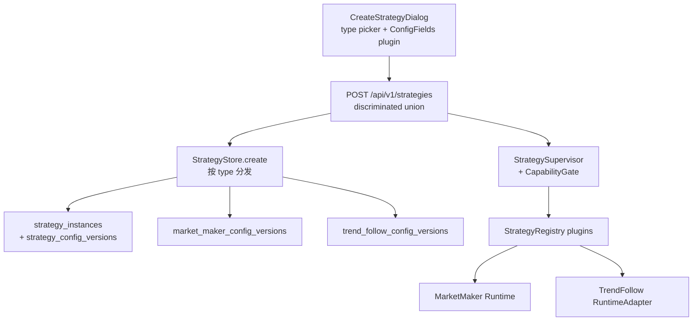

# HypeEdge 多策略控制面设计

> 状态：权威设计扩展。本文受 `docs/design.md` 约束，并由其中 §19 正式引用。
> 目标：把「仅做市可前端创建」泛化为「任意已注册策略类型均可创建」，同时统一实例、配置版本、生命周期与审计。

## 1. 问题与现状

当前存在两套并行策略路径：

| 维度 | `market_maker` | `trend_follow` |
|------|----------------|----------------|
| 实例化 | Postgres `strategy_instances` + API create | `app._init_strategy()` 硬编码单例（如 `trend_v1`） |
| 配置 | 不可变 `strategy_config_versions` + `market_maker_config_versions` | `configs/strategy_trend.yaml` + `ParamWatcher` |
| 生命周期 | `StrategySupervisor`（warming/shadow/running/…） | `StrategyRunner` + 简单 start/stop |
| Registry | `registry.register("market_maker", …)` | **未注册** |
| 前端创建 | `CreateMarketMakerDialog` → `POST /api/v1/strategies` | **无** |
| 列表 | MM control plane 启用后只查 Postgres | 仅当 MM repository 未初始化时 fallback 露出单例 |

DB `strategy_instances.strategy_type` CHECK 已预留 `trend_follow` / `legacy`，但 create、typed config、Registry、Runtime 四层仍写死做市。

实现锚点（现状）：

- Registry：`src/hypeedge/strategy/registry.py`
- Supervisor：`src/hypeedge/strategy/supervisor.py`
- Create 硬编码 gate：`src/hypeedge/storage/market_making.py`（拒绝非 `market_maker`）
- API schema：`src/hypeedge/api/schemas.py` 中 `StrategyCreateRequest.strategy_type: Literal["market_maker"]`
- 前端 create：`web/components/strategy/create-market-maker-dialog.tsx`

## 2. 设计结论

采用 **Strategy Type Plugin（策略类型插件）+ 统一控制面**：

1. **共享壳**：实例注册、配置版本元数据、`(sub_account, symbol)` allocation、启停命令、幂等、RBAC、审计。
2. **类型插件**：强类型配置校验、typed 配置子表写入、Runtime factory、生命周期能力声明、前端 ConfigFields。
3. **唯一 create 入口**：`POST /api/v1/strategies`，请求体为 `strategy_type` 判别联合。
4. **配置权威**：实例参数以 Postgres 不可变配置版本为主；YAML / 环境 Settings 只保留安全默认与上限。
5. **禁止**：按类型永久平行 create API；以无约束 JSONB 作为交易关键配置主存；强制所有策略走完整做市 shadow/drain 语义；前端可建但 runtime 仍以 YAML 为双主。

做市算法、quote plan、action budget 仍以 `docs/design.md` §18 与 `docs/market_making_design.md` 为准；本文只定义**多类型控制面与创建契约**。

## 3. 目标架构



控制流要点：

- Create 只持久化实例与初始 config version（desired_state=`stopped`），不自动启动。
- Start/stop/pause/drain 走 Supervisor；CapabilityGate 按类型拒绝不支持的 action。
- Registry 从「仅存 factory」升级为「存完整 plugin」；`create(context)` 仍返回 `StrategyRuntimeHandle`。

## 4. StrategyTypePlugin 契约

每种策略类型注册一份插件。第一批类型：`market_maker`、`trend_follow`。`legacy` 仅兼容展示，**不可 create**。

| 能力 | 说明 |
|------|------|
| `strategy_type` | 稳定类型名（小写） |
| `validate_create_config` | Pydantic 强类型校验初始/新版本配置 |
| `persist_config_version` | 写入对应 `{type}_config_versions` + `config_hash` |
| `decode_config` | `StrategyConfigSnapshot` → 运行参数对象 |
| `factory` | `(StrategyBuildContext) -> StrategyRuntimeHandle` |
| `capabilities` | 支持的 desired/actual 状态、actions、是否有专用工作台、`creatable` |
| `default_config` | 创建表单默认值（必须落在环境安全上限内） |

新增第三种策略时，边际成本应为：schema + typed 表 + factory + ConfigFields + capabilities 注册；**不修改** create 壳与 Supervisor 核心状态机。

## 5. 生命周期能力子集

共用 `StrategySupervisor`，按类型声明能力，不复制第二套 Supervisor。

| 类型 | 操作员 desired | 说明 |
|------|----------------|------|
| `market_maker` | `stopped` / `shadow` / `running` / `paused`，并支持 `drain` | 完整做市语义；shadow 为决策/执行影子模式 |
| `trend_follow` | `stopped` / `running` / `paused` | 不要求对外 shadow；启动时可短暂内部 `warming`（数据就绪），不作为独立产品态强加给 UI |

CapabilityGate 规则：

- 对不支持的 `/actions/{name}` 返回 `409` 或 `422`（problem+json），文案标明类型能力。
- 列表与详情返回的 `actual_state` 仍使用统一枚举字符串；前端按 capabilities 隐藏不可用按钮。

## 6. 存储

### 6.1 复用共享表

- `strategy_instances`（CHECK 已含 `trend_follow`）
- `strategy_config_versions`（version、config_hash、created_by）
- `strategy_allocations`（活跃 `(sub_account, symbol)` 排他）
- `strategy_runtime_state` / `strategy_state_events`

有交易历史的实例只允许 archive，不硬删除（与做市设计一致）。

### 6.2 新增 `trend_follow_config_versions`

与 `market_maker_config_versions` 同模式：`config_version_id` PK/FK → `strategy_config_versions.id`。

列与 `TrendParams`（`src/hypeedge/strategy/params.py`）对齐：

| 列 | 约束要点 |
|----|----------|
| `fast_ema_period` / `slow_ema_period` / `signal_ema_period` | `> 0`；fast &lt; slow |
| `momentum_period` | `> 0` |
| `momentum_threshold` | `NUMERIC(38,18)` |
| `atr_period` | `> 0` |
| `atr_position_multiplier` / `atr_stop_multiplier` | `> 0`，`NUMERIC(38,18)` |
| `max_position_pct` / `risk_per_trade_pct` | `(0, 1]`，`NUMERIC(38,18)` |
| `macd_cross_threshold` | `NUMERIC(38,18)` |

`symbol` 留在 `strategy_instances`，不在配置子表重复权威字段。

**拒绝**「单一 JSONB 配置表」作为交易关键参数主存。JSONB 仅可用于非交易关键的扩展元数据（若将来需要），不得替代 typed 列与 CHECK。

### 6.3 Create 写入路径

`create_strategy_instance` 按 `strategy_type` 分发：

1. 插入 `strategy_instances`（desired_state=`stopped`）。
2. 插入 `strategy_config_versions`（version=1）+ 对应 typed 子表。
3. 设置 `desired_config_version_id`，初始化 `strategy_runtime_state`。
4. 不自动 acquire allocation（启动时再占租约），避免「创建即占坑却从未运行」。

## 7. API

### 7.1 创建（判别联合）

```text
StrategyCreateRequest =
  | {
      strategy_id, strategy_type: "market_maker",
      sub_account, symbol, metadata?,
      initial_config: MarketMakerConfig
    }
  | {
      strategy_id, strategy_type: "trend_follow",
      sub_account, symbol, metadata?,
      initial_config: TrendFollowConfig
    }
```

- 唯一入口：`POST /api/v1/strategies`
- 继续强制：Operator+ 角色、CSRF、`Idempotency-Key`、`application/problem+json`
- `GET /api/v1/strategies` 以 Postgres 实例列表为权威；过渡期可合并尚未 backfill 的 legacy 单例，但目标态删除该 fallback

### 7.2 配置版本

- `GET/POST /api/v1/strategies/{id}/config-versions`：body/response 同样按实例 `strategy_type` 判别联合
- `POST .../config-versions/{version}/activate`：带 revision / `If-Match`；运行中实例在安全点 `apply_config`

### 7.3 生命周期

- 统一：`POST /api/v1/strategies/{id}/actions/{start|pause|resume|drain|stop}`
- 过渡期保留 legacy `POST .../start` 与 `.../stop`（仅 trend 旧路径），文档与代码标记 deprecated；P2 删除

## 8. Runtime 与应用接线

### 8.1 TrendFollow RuntimeAdapter

用 adapter 包装现有 `TrendFollowStrategy` + `StrategyRunner`，实现 `StrategyRuntimeHandle`：

- `start` / `stop`
- `set_mode`：映射 `running` / `paused`（及内部 warming）
- `apply_config`：从 typed snapshot 解码为 `TrendParams` 并热替换

在 `app` 初始化 MM 组件时同步 `registry.register` trend 插件（或统一 `register_builtin_strategy_plugins()`）。

### 8.2 退役硬编码单例

P1/P2 完成后：

1. 删除或门控 `app._init_strategy()` 对 `trend_v1` 的硬编码构造。
2. 启动时从 Postgres restore desired≠stopped 的实例（与做市 restore 同路径）。
3. 可选一次性 backfill：将现网/开发中的 `trend_v1` 写入 `strategy_instances` + 初始 config version。
4. `configs/strategy_trend.yaml` 降级为环境默认与上限来源，**不再**作为运行中实例参数权威；`ParamWatcher` 不再驱动已托管实例。

## 9. 前端

### 9.1 通用创建壳

将「新建做市策略」升级为「新建策略」：

1. 选择 `strategy_type`（只展示 `capabilities.creatable === true` 的已注册类型；首期可由前端常量与后端注册表对齐）。
2. 公共字段：`strategy_id`、`symbol`、`sub_account`。
3. 类型字段组件注册表：
   - `market_maker` → 现有 `MarketMakerConfigFields`
   - `trend_follow` → 新增 `TrendFollowConfigFields`
4. `web/lib/types.ts` 中 `StrategyCreateRequest` 改为判别联合，与后端 schema 同步。

### 9.2 列表与导航

- 策略列表统一展示所有 Postgres 实例（含 type chip）。
- `market_maker` → `/strategy/[id]/market-making`
- `trend_follow` → `/strategy/[id]`（参数、信号、启停；后续可扩展趋势工作台）
- 启停：一律调用 `/actions/*` + `If-Match` revision（P1 起）；过渡期 hook 可按 type 分支 legacy 路径

## 10. 分期落地

### P0 — 契约与创建打通

- Plugin 接口与 MM/trend 注册骨架（trend factory 可暂返回 not-runnable stub，或仅 persist）
- API / TS 判别联合 create
- Alembic：`trend_follow_config_versions`
- 通用 Create Dialog + Trend ConfigFields
- Create 后实例 `stopped` 出现在列表

### P1 — 运行时统一

- Trend `RuntimeHandle` 完整实现并注册
- 启停走 Supervisor + CapabilityGate
- Config version activate → `apply_config`
- 前端启停统一 `/actions/*`

### P2 — 退役 legacy

- 移除 `app._init_strategy` 硬编码与实例级 ParamWatcher 双主
- 删除 list fallback 与 legacy `/start|/stop`
- 更新运维文档与验收清单

### P3 — 边际扩展

- 新策略类型 = 一份 plugin + typed 表 + ConfigFields；create 壳与 Supervisor 核心零改或极少改

## 11. 验收标准

- 前端可为 `market_maker` 与 `trend_follow` 创建实例，且均走 `POST /api/v1/strategies`。
- MM control plane 启用时，列表不再依赖「repository 关闭才露出 trend」的 fallback（P2 完成后）。
- 同 `(sub_account, symbol)` 仍受 allocation 排他约束。
- 配置变更只追加 version，可 activate / rollback；精确数值为 decimal string / `NUMERIC(38,18)`。
- 对 `trend_follow` 调用 `drain` 或 `start` 目标为 `shadow` 时被 CapabilityGate 拒绝。
- 新增第三种策略时，不必再改通用 create Dialog 壳与 Supervisor 核心状态机。

## 12. 刻意不做

| 方案 | 原因 |
|------|------|
| 为 trend 永久保留专用 create API / Dialog | 每加一种策略复制一套，继续双轨 |
| JSONB 作为交易关键配置唯一存储 | 失去 NUMERIC/CHECK/类型安全，与做市设计冲突 |
| 强制所有策略完整 MM 生命周期 | shadow/drain 对趋势无产品语义 |
| 前端可建但 runtime 仍 YAML 单例权威 | 配置双主，列表与启停不一致 |
| `legacy` 类型可 create | 仅兼容展示，避免新垃圾实例 |

## 13. 文档关系

| 文档 | 职责 |
|------|------|
| `docs/design.md` §19 | 冻结跨模块决策，正式引用本文 |
| `docs/strategy_control_plane.md`（本文） | 多类型控制面与前端创建权威细节 |
| `docs/market_making_design.md` | 做市算法、quote、budget、MM typed 表 |
| `docs/frontend_design.md` | 页面职责与数据源；策略创建交互摘要 |
| `docs/market_making_implementation_plan.md` | 做市实施顺序；Trend 迁入控制面见本文 §10 |
